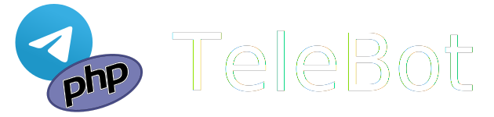

<p align="center">
<a href="https://github.com/westacks/telebot"></a>
</p>

<p align="center">
<a href="https://packagist.org/packages/westacks/telebot"></a>
<a href="https://core.telegram.org/bots/api"></a>
<a href="https://packagist.org/packages/westacks/telebot"></a>
<a href="https://packagist.org/packages/westacks/telebot"></a>
<a href="https://github.com/westacks/telebot/actions/workflows/main.yml"></a>
<a href="https://app.fossa.com/projects/git%2Bgithub.com%2Fwestacks%2Ftelebot?ref=badge_shield" alt="FOSSA Status"></a>
</p>

TeleBot is a PHP library for telegram bots development. Rich Laravel support out of the box. Has an easy, clean, and extendable way to handle telegram Updates.

## Documentation

Documentation for the library can be found on the [website](https://westacks.github.io/telebot/).

## Features
### Bot Manager

Work easily with multiple bots using `BotManager`:
```php
$manager->getMe(); // Fired by default bot specified in BotManager
$manager->bot('bot2')->getMe(); // Fired by `bot2` specified in BotManager
```

### Object oriented and functional handlers

```php
// Functional handler
$handler = function(TeleBot $bot, Update $update, $next) {
    if ($update->message->text === '/start') {
        return $bot->sendMessage([
            'chat_id' => $update->chat()->id,
            'text' => 'Hello, World!'
        ]);
    }

    return $next();
};


// Object oriented handler
class YourUpdateHandler extends CommandHandler
{
    protected static $aliases = ['/start'];
    protected static $description = 'Your description';

    public function handle()
    {
        return $this->sendMessage([
            'text' => 'Hello, World!'
        ]);
    }
}
```

### Laravel Support

Check out [Laravel Adapter](https://github.com/westacks/telebot-laravel) for TeleBot

## Changelog

Please see [CHANGELOG](CHANGELOG.md) for more information what has changed recently.

## Contributing

Please see [CONTRIBUTING](CONTRIBUTING.md) for details.

## Credits

- [Dmytro Morozov](https://github.com/PunyFlash)
- [All Contributors](https://github.com/westacks/telebot/graphs/contributors)

## License

The MIT License (MIT). Please see [License File](LICENSE.md) for more information.


[](https://app.fossa.com/projects/git%2Bgithub.com%2Fwestacks%2Ftelebot?ref=badge_large)
